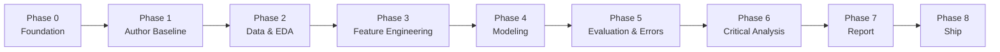

# Execution Plan — IDS NSL-KDD Reproduction Project

**Companion doc:** [`prd.md`](./prd.md)  
**Deadline:** Friday, July 10, 2026, 23:59  
**Scope:** Option A — Arcos-Argudo et al. (2025) on NSL-KDD (binary IDS)

---

## Phase overview



| Phase | Name | Duration | Depends on |
|-------|------|----------|------------|
| 0 | Foundation & Environment | ~2 h | — |
| 1 | Author Baseline Reproduction | ~4 h | 0 |
| 2 | Data Loading & EDA | ~6 h | 0, 1 |
| 3 | Feature Engineering | ~4 h | 2 |
| 4 | Model Training | ~6 h | 3 |
| 5 | Evaluation & Error Analysis | ~4 h | 4 |
| 6 | Critical Evaluation Synthesis | ~4 h | 1, 5 |
| 7 | Report & Documentation | ~6 h | 2–6 |
| 8 | Final QA & Submission | ~3 h | 7 |

**Total estimate:** ~39 hours across 6 working days (Jul 4–10, 2026)

---

## Phase 0 — Foundation & Environment

**Objective:** Stand up the project skeleton so every later phase has a stable workspace.

### Inputs
- Empty project directory
- Assignment brief (`haifaUEX.pdf`)
- Article PDF (`algorithms-18-00749.pdf`)

### Tasks
1. Initialize Git repository
2. Create directory structure per `prd.md` Section 6.1
3. Write `requirements.txt` with pinned dependencies
4. Write `.gitignore` (exclude `data/raw/`, `__pycache__/`, `.ipynb_checkpoints/`, venv)
5. Clone author repo into `vendor/IDS-KDD-CICIDS2017/` for reference (not submitted as our work)
6. Download NSL-KDD `KDDTrain+.txt` and `KDDTest+.txt` into `data/raw/`
7. Create empty `src/` modules with module docstrings
8. Draft initial `README.md` skeleton

### Outputs
- [ ] Repo structure committed
- [ ] `requirements.txt` installs without error
- [ ] Raw data files present locally
- [ ] Author repo cloned and inspected

### Exit criteria
Environment installs cleanly; data files verified; project tree matches PRD.

---

## Phase 1 — Author Baseline Reproduction

**Objective:** Run the original replication package on NSL-KDD and capture the authors' reference metrics.

### Inputs
- NSL-KDD raw files (Phase 0)
- Author repo configs and scripts (Phase 0)
- Target metrics from PRD Section 9.4

### Tasks
1. Identify author repo entry point for NSL-KDD binary classification
2. Map author preprocessing steps to a written checklist
3. Run pipeline **without SMOTE** — record all metrics
4. Run pipeline **with SMOTE (train only)** — record all metrics
5. Save results to `results/baseline_reproduction.csv`
6. Diff our numbers against paper Tables 4 and 5
7. Document environment versions in `docs/reproducibility_notes.md`
8. Log any failures, workarounds, or hidden preprocessing steps

### Outputs
- [ ] `results/baseline_reproduction.csv`
- [ ] `docs/reproducibility_notes.md` (Phase 1 section)
- [ ] Metric comparison table (ours vs paper)

### Exit criteria
LR metrics within ±0.02 of paper Table 4, **or** documented explanation for deviation. At least one additional model (LDA or AE+LR) attempted.

---

## Phase 2 — Data Loading & Exploratory Data Analysis

**Objective:** Build the notebook's data and EDA sections; produce insights that feed feature engineering and the report.

### Inputs
- NSL-KDD raw files
- NSL-KDD column name reference from author repo
- Reproducibility notes from Phase 1

### Tasks
1. Implement `src/data_loading.py`
   - Load train/test with correct dtypes
   - Define canonical column names
   - Drop `difficulty`
2. Notebook section: **Data Loading & Inspection**
   - Shape, dtypes, memory, missing values
   - Single-value and duplicate feature detection
   - Column/index naming sanity check
   - Temporal limitation note (no timestamps in NSL-KDD)
3. Notebook section: **EDA**
   - Label distribution (binary and multi-class)
   - Feature distributions (histograms, value counts)
   - Outlier analysis (IQR / boxplots on key numerics)
   - Correlation matrices: Pearson + Spearman with written justification
   - Crosstabs: `protocol_type`, `service`, `flag` vs label
   - Class imbalance analysis — real-world IDS meaning
   - Did authors address imbalance? (preview SMOTE rationale)
4. Save all figures to `results/figures/eda/`

### Outputs
- [ ] `src/data_loading.py` complete
- [ ] Notebook sections 1–2 executable
- [ ] `results/figures/eda/` populated

### Exit criteria
Notebook runs through EDA without error; imbalance and correlation findings documented in markdown cells.

---

## Phase 3 — Feature Engineering

**Objective:** Implement and analyze the preprocessing pipeline; assess redundancy and meaningfulness.

### Inputs
- EDA findings (Phase 2)
- Paper Section 3.2 preprocessing spec
- Phase 1 reproducibility notes

### Tasks
1. Implement `src/preprocessing.py`
   - Binary label encoder
   - One-hot encoder (fit on train)
   - Min–max scaler (fit on train)
   - SMOTE wrapper (train only, optional branch)
   - sklearn `Pipeline` / `ColumnTransformer` composition
2. Notebook section: **Feature Engineering**
   - Document each transformation: what, why, cybersecurity rationale
   - Redundancy analysis: correlated feature clusters, near-duplicates
   - Before/after shape and sparsity
   - Optional: feature selection experiment (correlation threshold or RF importance)
   - Propose additional features or removals with justification
3. Verify no leakage: assert transformers fit on train only
4. Save preprocessing artifact metadata to `docs/reproducibility_notes.md`

### Outputs
- [ ] `src/preprocessing.py` complete
- [ ] Notebook section 3 executable
- [ ] Redundancy analysis with recommendation

### Exit criteria
Preprocessing pipeline returns consistent `X_train`, `X_test`, `y_train`, `y_test`; leakage checks pass.

---

## Phase 4 — Model Training

**Objective:** Train all required models and save artifacts for evaluation.

### Inputs
- Preprocessed data from Phase 3
- Model specs from PRD Section 9.3
- Baseline metrics from Phase 1

### Tasks
1. Implement `src/models.py`
   - `get_models()` returning configured estimators
   - AE+LR hybrid builder (TensorFlow autoencoder + sklearn LR)
   - SMOTE/no-SMOTE branch support
2. Implement training loop with fixed `random_state=42`
3. Notebook section: **Model Training**
   - Train: NB, LR, LDA, RF, AE+LR
   - Both regimes: without SMOTE and with SMOTE (train only)
   - Record wall-clock training time per model
   - Save models to `results/models/` (gitignored if large)
4. Compare training output to Phase 1 baseline — flag divergences

### Outputs
- [ ] `src/models.py` complete
- [ ] Notebook section 4 executable
- [ ] Trained models for all required estimators
- [ ] Training time log

### Exit criteria
All five model families train without error on NSL-KDD; predictions generated for test set.

---

## Phase 5 — Evaluation & Error Analysis

**Objective:** Compute full metrics, interpret them in IDS context, and analyze failure modes.

### Inputs
- Test-set predictions from Phase 4
- Phase 1 baseline for comparison

### Tasks
1. Implement `src/evaluation.py`
   - Metric functions: Acc, Prec, Rec, F1, MCC, AUC, FAR
   - Confusion matrix plotting
   - Results aggregation to DataFrame
2. Notebook section: **Evaluation**
   - Metrics table per model (both SMOTE regimes)
   - ROC curves overlay (match paper Figure 1 style)
   - Per-metric markdown: definition + cybersecurity interpretation
   - FP vs FN cost discussion for SOC operators
   - Justify metric selection; note excluded metrics
3. Notebook section: **Error Analysis**
   - Confusion matrix breakdown by attack subtype (R2L, U2R focus)
   - Patterns in FP (benign flagged as attack) and FN (missed attacks)
   - Model comparison: NB conservative vs LR/AE+LR balanced
   - Threshold discussion (default 0.5 vs operational tuning)
4. Save metrics to `results/experiment_metrics.csv`
5. Save figures to `results/figures/eval/`

### Outputs
- [ ] `src/evaluation.py` complete
- [ ] Notebook sections 5–6 executable
- [ ] `results/experiment_metrics.csv`
- [ ] ROC curves and confusion matrices saved

### Exit criteria
Full metric suite computed for all models; error analysis includes attack-subtype breakdown and FP/FN trade-off.

---

## Phase 6 — Critical Evaluation Synthesis

**Objective:** Convert reproduction results into structured critique of the authors' claims.

### Inputs
- `results/baseline_reproduction.csv` (Phase 1)
- `results/experiment_metrics.csv` (Phase 5)
- EDA and feature engineering findings (Phases 2–3)
- Author claims C1–C7 from PRD Section 5

### Tasks
1. Build claim evaluation matrix:

   | Claim | Evidence | Verdict | Notes |
   |-------|----------|---------|-------|
   | C1: AE+LR best AUC | our AUC table | Supported / Partial / Rejected | |
   | C2: SMOTE helps NSL-KDD | F1 delta with/without | | |
   | C3: Leakage-free | pipeline audit | | |
   | C4: LR/LDA strong baselines | metric comparison | | |
   | C5: NB high Prec, low Rec | our NB metrics | | |
   | C6: FAR essential | FAR vs accuracy analysis | | |
   | C7: Byte-level reproducibility | Phase 1 diff | | |

2. Identify methodology weaknesses:
   - Binary collapse hides rare attacks (R2L, U2R)
   - NSL-KDD is legacy data — external validity
   - Accuracy misleading under imbalance
   - Near-ceiling metrics and practical significance
3. Identify strengths:
   - Leakage-aware pipeline design
   - FAR reporting
   - Public replication package
   - Deterministic seeds
4. Draft conclusions: recommend or not for similar problems?
5. Write notebook **Executive Summary** markdown cell (~1 page)

### Outputs
- [ ] Claim evaluation matrix (in `docs/critical_evaluation.md`)
- [ ] Notebook executive summary cell
- [ ] Bullet list of report-ready findings

### Exit criteria
Every claim C1–C7 has a verdict with evidence; executive summary written.

---

## Phase 7 — Report & Documentation

**Objective:** Produce the PDF report and finalize all repository documentation.

### Inputs
- All notebook outputs and figures
- `docs/critical_evaluation.md`
- `docs/reproducibility_notes.md`
- PRD Section 8 report structure

### Tasks
1. Write `report/final_project_report.pdf` sections:
   - Executive Summary
   - §1 Summary of the Source
   - §2 Critical Evaluation
   - §3 Feature Engineering Analysis
   - §4 Reproducibility Analysis
   - §5 Experimental Results
   - §6 Conclusions
   - §7 Summing It Up
2. Embed key figures from `results/figures/`
3. Finalize `README.md`:
   - Project description
   - Links: article DOI, original repo, dataset
   - Setup and run instructions
   - Expected runtime
   - Oral defense cheat sheet (key numbers and claims)
4. Ensure `prd.md` and `plan.md` are in repo root
5. Clean notebook: remove dead cells, verify top-to-bottom execution

### Outputs
- [ ] `report/final_project_report.pdf`
- [ ] Complete `README.md`
- [ ] Clean, executable notebook

### Exit criteria
Report covers all PRD Section 8 sections; README passes PRD Section 6.4 checklist.

---

## Phase 8 — Final QA & Submission

**Objective:** Validate everything end-to-end and submit.

### Inputs
- All artifacts from Phases 0–7

### Tasks
1. Fresh-environment test:
   - New venv → `pip install -r requirements.txt`
   - Download data per README
   - Run notebook top-to-bottom
2. Verify PRD acceptance criteria (Section 12)
3. Verify rubric coverage (PRD Section 11)
4. Push to public GitHub
5. Final commit tag: `v1.0-submission`
6. Send repo URL to examiner per assignment instructions

### Outputs
- [ ] Clean run log from fresh environment
- [ ] Public GitHub URL
- [ ] Submission confirmation

### Exit criteria
All PRD "Must pass" acceptance criteria checked; repo public; submitted before deadline.

---

## Timeline

| Date | Phases | Milestone |
|------|--------|-----------|
| **Jul 4** | 0, 1 | Environment ready; baseline metrics captured |
| **Jul 5** | 2 | EDA complete |
| **Jul 6** | 3, 4 | Preprocessing + all models trained |
| **Jul 7** | 5, 6 | Metrics, error analysis, claim verdicts |
| **Jul 8** | 7 | PDF report draft complete |
| **Jul 9** | 7, 8 | Polish, fresh-run QA |
| **Jul 10** | 8 | Submit before 23:59 |

---

## Phase dependencies (strict order)

```
Phase 0 ──► Phase 1 ──► Phase 6
              │
Phase 0 ──► Phase 2 ──► Phase 3 ──► Phase 4 ──► Phase 5 ──► Phase 6
                                                                │
                                                                ▼
                                              Phase 7 ──► Phase 8
```

- **Phase 1** can start immediately after Phase 0 (parallel to Phase 2 setup, but Phase 6 needs both).
- **Phases 2→3→4→5** are strictly sequential.
- **Phase 6** requires Phase 1 (baseline) and Phase 5 (our results).
- **Phase 7** requires Phase 6.
- **Phase 8** requires Phase 7.

---

## Definition of done (project level)

The project is complete when Phase 8 exit criteria are met and every item in `prd.md` Section 12 "Must pass" is checked.
